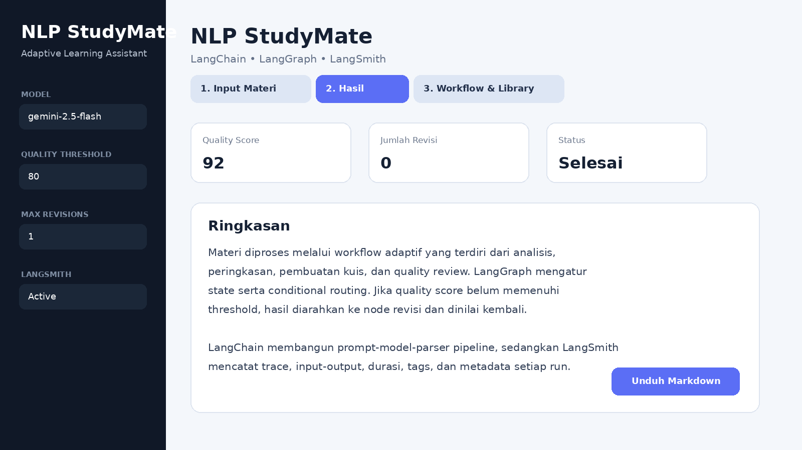
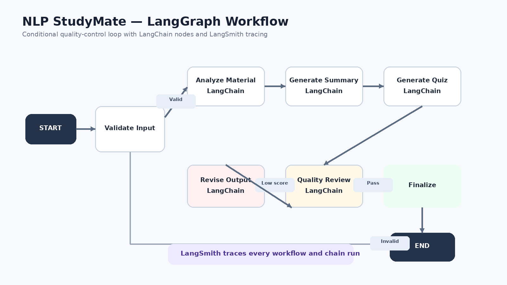

# NLP StudyMate

**NLP StudyMate** adalah asisten belajar adaptif yang mengubah materi kuliah menjadi analisis terstruktur, ringkasan, dan kuis pilihan ganda. Sistem menggunakan **LangChain**, **LangGraph**, dan **LangSmith** sebagai tiga komponen utama.



## Tujuan Proyek

Proyek ini dibuat untuk memenuhi Ujian Akhir Semester mata kuliah Natural Language Processing. Implementasi menunjukkan pemisahan fungsi yang jelas:

- **LangChain**: prompt template, integrasi model Gemini, dan output parser.
- **LangGraph**: state, node, edge, conditional routing, serta loop revisi.
- **LangSmith**: tracing, debugging, metadata, durasi, dan observabilitas workflow.

## Fitur

1. Analisis materi kuliah.
2. Ringkasan terstruktur.
3. Pembuatan lima soal pilihan ganda dan pembahasan.
4. Quality review dengan skor 0-100.
5. Revisi otomatis jika skor belum mencapai threshold.
6. Unduh hasil dalam format Markdown.
7. Trace workflow di LangSmith.
8. Mode demo untuk melihat antarmuka tanpa API key.

## Arsitektur Workflow



Alur utama:

```text
START
  -> Validate Input
  -> Analyze Material
  -> Generate Summary
  -> Generate Quiz
  -> Quality Review
       -> jika skor rendah: Revise Output -> Quality Review
       -> jika skor cukup: Finalize
  -> END
```

## Struktur Folder

```text
UAS_NLP_StudyMate/
├── app.py
├── src/
│   ├── chains.py
│   ├── config.py
│   ├── demo.py
│   ├── graph.py
│   ├── state.py
│   └── utils.py
├── data/
│   └── sample_materi.txt
├── docs/
│   ├── architecture.mmd
│   ├── architecture.png
│   └── screenshots/dashboard-preview.png
├── scripts/
│   └── demo_cli.py
├── tests/
│   └── test_workflow.py
├── .env.example
├── requirements.txt
├── NASKAH_VIDEO_UAS.md
├── LAPORAN_UAS_NLP_StudyMate.md
├── PANDUAN_PENGUMPULAN_FINAL.md
├── HASIL_DEMO_MARKDOWN.md
└── SUBTITLE_TEMPLATE.srt
```

## Persyaratan

- Python 3.10 atau lebih baru.
- Google Gemini API key.
- LangSmith API key untuk menampilkan trace.

## Instalasi Windows

### Cara cepat

1. Ekstrak folder proyek.
2. Klik dua kali `setup_windows.bat`.
3. Buka `.env` dan isi API key.
4. Klik dua kali `run_windows.bat`.

### Cara manual

```bash
py -m venv .venv
.venv\Scripts\activate
pip install -r requirements.txt
copy .env.example .env
streamlit run app.py
```

## Instalasi Linux/macOS

```bash
chmod +x setup_linux.sh run.sh
./setup_linux.sh
# edit file .env
./run.sh
```

## Konfigurasi `.env`

```env
GOOGLE_API_KEY=isi_api_key_google_ai_studio
GOOGLE_MODEL=gemini-2.5-flash

LANGSMITH_TRACING=true
LANGSMITH_API_KEY=isi_api_key_langsmith
LANGSMITH_PROJECT=uas-nlp-studymate

DEMO_MODE=false
QUALITY_THRESHOLD=80
MAX_REVISIONS=1
```

> Untuk demo final, gunakan `DEMO_MODE=false` agar hasil benar-benar diproses oleh LLM.

## Cara Menjalankan

```bash
streamlit run app.py
```

Buka alamat lokal yang ditampilkan Streamlit, biasanya:

```text
http://localhost:8501
```

## Menjalankan Versi CLI

```bash
python -m scripts.demo_cli
```

## Menjalankan Pengujian

```bash
pytest -q
```

Unit test utama berada pada `tests/test_workflow.py` dan menguji validasi input serta parsing skor quality review.

## Bukti Penggunaan Tiga Library

### 1. LangChain

Lihat `src/chains.py`.

```python
analysis_prompt | llm | StrOutputParser()
```

LangChain menyusun prompt, model, dan parser menjadi pipeline yang dapat dipanggil dengan `.invoke()`.

### 2. LangGraph

Lihat `src/graph.py`.

```python
builder = StateGraph(StudyState)
builder.add_node("quality_review", quality_review)
builder.add_conditional_edges(...)
```

Conditional routing digunakan untuk menentukan apakah output perlu direvisi atau langsung difinalisasi.

### 3. LangSmith

Tracing dikonfigurasi melalui `.env`:

```env
LANGSMITH_TRACING=true
LANGSMITH_API_KEY=...
LANGSMITH_PROJECT=uas-nlp-studymate
```

Setiap chain dan workflow diberi `run_name`, `tags`, dan `metadata` sehingga trace mudah dijelaskan pada video.

## Langkah Demo Video

1. Tampilkan struktur folder dan README.
2. Jelaskan `src/chains.py` sebagai implementasi LangChain.
3. Jelaskan `src/state.py` dan `src/graph.py` sebagai implementasi LangGraph.
4. Jalankan aplikasi Streamlit.
5. Masukkan materi lalu klik **Jalankan Workflow**.
6. Tampilkan hasil analisis, ringkasan, kuis, quality score, dan jumlah revisi.
7. Buka LangSmith lalu tunjukkan trace workflow.
8. Jelaskan input-output, latency, tags, metadata, serta node yang dieksekusi.

## Catatan Akademik

- Sesuaikan nama proyek, narasi, dan tampilan dengan identitas sendiri.
- Pahami setiap bagian kode sebelum presentasi.
- Jangan mengakui mode demo sebagai pemrosesan LLM.
- Ganti screenshot README dengan screenshot aplikasi yang benar-benar dijalankan sebelum pengumpulan.

## Lisensi

Proyek ini dibuat untuk kebutuhan pembelajaran dan demonstrasi akademik.
